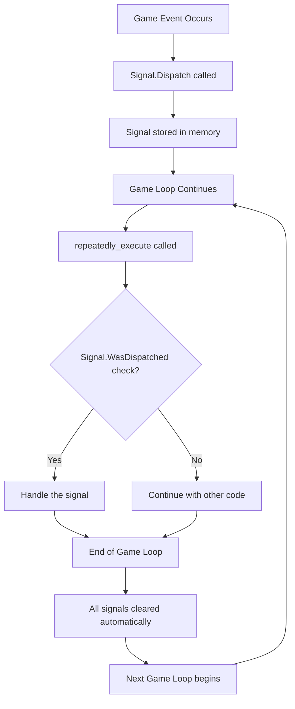

# Clickpulp Signal Module

## About

This module lets different parts of your game talk to each other easily without getting tangled up. Think of it like a message system - one part of your game can send a message saying "the player opened a door" and other parts can listen for that message and react.

**Why this is useful:** Instead of having your scripts directly call each other (which gets messy), you can have them send and receive messages. This keeps your code organized and makes it easier to add new features later.

## How Signals Work

The diagram below shows the complete signal lifecycle in AGS:



**Key Points:**
- **Signals are dispatched** when events happen anywhere in your game
- **Signals are checked** during the game loop in `repeatedly_execute()` or `repeatedly_execute_always()`
- **Signals last only one frame** - they're automatically cleared at the end of each frame
- **Multiple handlers** can check for the same signal in different parts of your code

## Dependencies

* This module does not use any functionality from other modules.

## Usage

```agscript
// Dispatch a Signal:
Signal.Dispatch("dancing_ended");

// From a repeatedly execute call, you can check the signal:

// Check if a Signal was dispatched:
if (Signal.WasDispatched("dancing_ended")) {}

// Send a Signal with values (you can send up to 3 int values):
Signal.Dispatch("room_changed", nextRoom, previousRoom);

// Get Signal values individually:
if (Signal.WasDispatched("room_changed")) {
  int currentRoom = Signal.GetValue("room_changed", 0);
  int previousRoom = Signal.GetValue("room_changed", 1);
}

// Check value of a Signal quickly:
if (Signal.WasDispatchedWithValue("room_changed", 5)) {} // Current room
if (Signal.WasDispatchedWithValue("room_changed", 4, 1)) {} // Previous room (index 1)
```

## API Reference

### Signal Dispatch Methods

* `Signal.Dispatch(String name)` - Dispatch a signal with no values
* `Signal.Dispatch(String name, int value1)` - Dispatch a signal with 1 value
* `Signal.Dispatch(String name, int value1, int value2)` - Dispatch a signal with 2 values  
* `Signal.Dispatch(String name, int value1, int value2, int value3)` - Dispatch a signal with 3 values

### Signal Check Methods

* `Signal.WasDispatched(String name)` - Check if a signal was dispatched this frame
* `Signal.WasDispatchedWithValue(String name, int value)` - Check signal and first value
* `Signal.WasDispatchedWithValue(String name, int value, int index)` - Check signal and value at index

### Signal Value Methods

* `Signal.GetValue(String name, int index)` - Get value from dispatched signal by index

## Advanced Usage

### Complex Game Events

```agscript
// Dispatch complex events with multiple values
function OnPlayerLevelUp(int newLevel, int skillPoints, int newHP) {
  Signal.Dispatch("player_level_up", newLevel, skillPoints, newHP);
}

function OnItemPickup(int itemID, int quantity, int rarity) {
  Signal.Dispatch("item_pickup", itemID, quantity, rarity);
}

// Handle the events elsewhere
function repeatedly_execute() {
  if (Signal.WasDispatched("player_level_up")) {
    int level = Signal.GetValue("player_level_up", 0);
    int skillPts = Signal.GetValue("player_level_up", 1);
    int hp = Signal.GetValue("player_level_up", 2);
    
    ShowLevelUpEffect(level, skillPts, hp);
  }
  
  if (Signal.WasDispatched("item_pickup")) {
    int itemID = Signal.GetValue("item_pickup", 0);
    int qty = Signal.GetValue("item_pickup", 1);
    int rarity = Signal.GetValue("item_pickup", 2);
    
    ShowItemPickupNotification(itemID, qty, rarity);
    UpdateInventoryDisplay();
  }
}
```

### Decoupled System Communication

```agscript
// Audio system listens for game events
function AudioManager_RepeatExecute() {
  if (Signal.WasDispatched("door_opened")) {
    aDoorCreak.Play();
  }
  
  if (Signal.WasDispatched("player_hurt")) {
    int damage = Signal.GetValue("player_hurt", 0);
    if (damage > 50) {
      aPlayerScream.Play();
    } else {
      aPlayerGrunt.Play();
    }
  }
}

// UI system responds to game state changes
function UI_RepeatExecute() {
  if (Signal.WasDispatched("player_health_changed")) {
    int newHealth = Signal.GetValue("player_health_changed", 0);
    int maxHealth = Signal.GetValue("player_health_changed", 1);
    UpdateHealthBar(newHealth, maxHealth);
  }
  
  if (Signal.WasDispatched("quest_completed")) {
    int questID = Signal.GetValue("quest_completed", 0);
    ShowQuestCompletedNotification(questID);
  }
}
```

### Signal-Based State Machine

```agscript
// Game state management using signals
enum GameState {
  eGameStatePlaying,
  eGameStatePaused,
  eGameStateMenu,
  eGameStateDialog
};

GameState currentState;

function ChangeGameState(GameState newState) {
  Signal.Dispatch("game_state_change", currentState, newState);
  currentState = newState;
}

function HandleStateChanges() {
  if (Signal.WasDispatched("game_state_change")) {
    int oldState = Signal.GetValue("game_state_change", 0);
    int newState = Signal.GetValue("game_state_change", 1);
    
    // Handle state transitions
    if (oldState == eGameStatePlaying && newState == eGameStatePaused) {
      // Pause music, show pause overlay, etc.
    }
  }
}
```

## Best Practices

1. **Use descriptive names**: Choose clear, meaningful signal names like "player_died" not "pd"
2. **Consistent naming**: Use consistent naming conventions (snake_case, camelCase, etc.)
3. **Limit values**: Signals support up to 3 integer values - use them wisely
4. **One frame only**: Signals only last one frame - check them in `repeatedly_execute()`
5. **Document signals**: Keep track of what signals your game uses and their value meanings
6. **Avoid circular dependencies**: Don't have signal handlers dispatch signals that create loops

## Performance Considerations

* Signals are cleared each frame automatically
* Signal checking is fast - safe to check multiple signals per frame  
* Consider caching frequently used signal names as constants
* Limit the number of different signal types for better performance

## Integration Example

```agscript
// Complete signal-based notification system
#define SIGNAL_ACHIEVEMENT_UNLOCKED "achievement_unlocked"
#define SIGNAL_PLAYER_DIED "player_died"
#define SIGNAL_GAME_SAVED "game_saved"

function TriggerAchievement(int achievementID) {
  Signal.Dispatch(SIGNAL_ACHIEVEMENT_UNLOCKED, achievementID);
}

function repeatedly_execute() {
  // Achievement system
  if (Signal.WasDispatched(SIGNAL_ACHIEVEMENT_UNLOCKED)) {
    int achID = Signal.GetValue(SIGNAL_ACHIEVEMENT_UNLOCKED, 0);
    ShowAchievementPopup(achID);
    PlayAchievementSound();
    SaveAchievementProgress();
  }
  
  // Death handling
  if (Signal.WasDispatched(SIGNAL_PLAYER_DIED)) {
    FadeToBlack();
    ShowGameOverScreen();
    ResetPlayerPosition();
  }
  
  // Save confirmation
  if (Signal.WasDispatched(SIGNAL_GAME_SAVED)) {
    ShowSaveConfirmation();
  }
}
```
